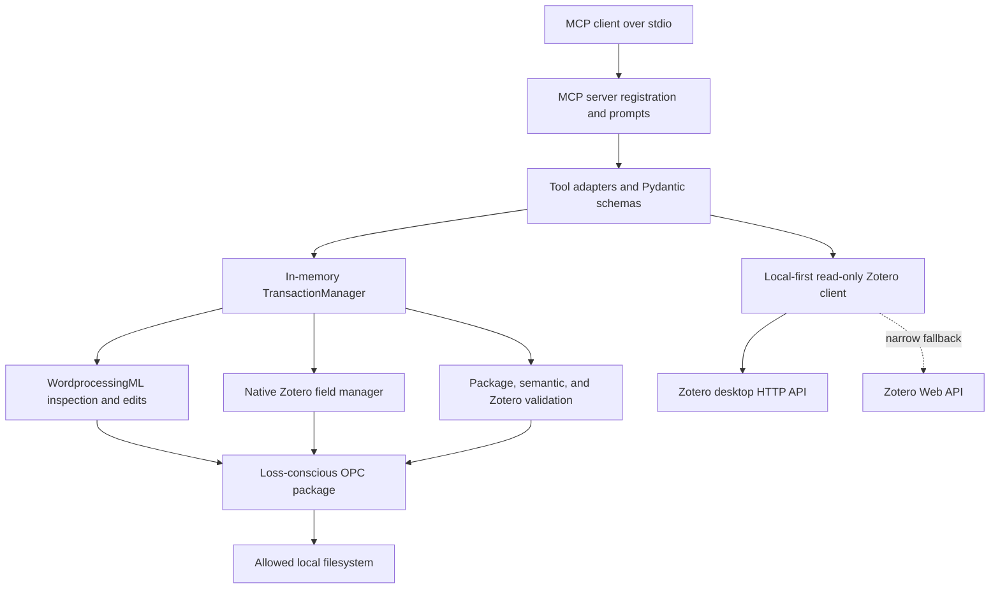

# Raven architecture

This document describes Raven 0.1.0 as implemented. It distinguishes structural
validation performed by Raven from compatibility validation that must still happen in
desktop Word and Zotero.

## Design constraints

Raven is designed around four constraints:

1. A `.docx` is an Open Packaging Convention (OPC) ZIP package, not just a sequence of
   paragraphs. Unrelated package parts must survive an edit.
2. Word fields, bookmarks, revisions, and structured markup create boundaries that
   ordinary text edits must not cross.
3. A model must not turn a proposed edit directly into an irreversible file write.
4. Zotero owns authoritative citation rendering. Raven can construct and preserve native
   fields, but cannot substitute for Zotero Refresh.

The implementation therefore favors conservative rejection over broad edit coverage.

## Layers



### MCP surface

`raven_mcp.server` creates one stdio `MCPServer`, registers document, citation, and Zotero
tools, and exposes one capability resource and two workflow prompts. Tool adapters convert
Pydantic inputs into domain requests. Expected `RavenError` failures are serialized as
model-visible MCP tool errors.

### Schemas and policy

`raven_mcp.schemas` defines strict, extra-forbidden request models, locators, edit
operations, transaction previews, commit results, and Zotero records.
`raven_mcp.config.Settings` resolves allowed filesystem roots and resource limits once
when a server is created.

### Transaction orchestration

`TransactionManager` opens and hashes documents, stages mutations in an independent
in-memory `OpcPackage`, validates staged output, holds pending transactions, and commits a
reviewed transaction. It also owns inspection, plain-citation scanning, and citation
transaction entry points.

### WordprocessingML

`raven_mcp.docx.wordml` discovers Word stories through internal relationships, extracts
visible text, creates paragraph locators, marks protected ranges, and performs conservative
text, paragraph, comment, and alt-text edits.

`raven_mcp.citations.fields` is a separate field-surgery layer. It parses complex Word
fields as begin/instruction/separator/result/end streams and inserts, replaces, or removes
whole fields only when their run and paragraph structure is safe.

### Zotero fields and library access

`CitationManager` constructs and parses Zotero citation/bibliography instructions and
maintains chunked `ZOTERO_PREF_*` custom properties. The library client is read-only and
separate from document mutation.

### Validation

The validation layer reports:

- OPC ZIP integrity, XML parseability, content types, and relationship targets;
- balanced complex fields, comments, bookmarks, and revision metadata;
- Zotero citation JSON, bibliography field syntax, and document-preference chunks.

Structural validity is necessary but does not prove that Word or Zotero will render a
document as intended.

## Data flow

### Inspection

```mermaid
sequenceDiagram
    participant C as MCP client
    participant T as TransactionManager
    participant P as OpcPackage
    participant W as WordML

    C->>T: document_inspect(path)
    T->>T: resolve allowed path; reject Word owner file
    T->>T: SHA-256 source
    T->>P: load and validate package
    P->>W: discover stories and parse content
    W-->>C: summary, locators, protected ranges, metadata
```

Inspection reads the entire package into memory and closes the source file. It does not
follow external package relationships. Paragraph results are paged at the tool boundary;
the underlying inspection still processes the complete document.

### Prepare and review

1. The caller supplies a document path, normally the inspection SHA-256, an intent, and
   either document operations or one citation operation.
2. Raven resolves and hashes the source, compares `expected_sha256` when present, and
   opens a safe package.
3. It clones the package and applies all requested mutations to the clone. A failed
   operation prevents transaction registration.
4. Raven performs full package, semantic, and Zotero validation on the staged clone.
5. If validation succeeds, Raven stores the clone in memory and returns:
   - a random transaction ID;
   - a random confirmation token;
   - source path and SHA-256;
   - creation and expiration times;
   - normalized operations and mutation result;
   - semantic diff entries, warnings, and the validation report.
6. The client or user reviews that preview. No document has been written.

Document-operation idempotency is optional. Reusing an `idempotency_key` while its
transaction remains live returns the existing preview. Raven does not compare a reused
key's new payload with the original payload. Citation prepare tools do not expose
idempotency keys.

### Commit

1. Raven looks up the non-expired in-memory transaction and constant-time compares the
   confirmation token.
2. It resolves the output under an allowed root and requires a `.docx` suffix.
3. It rejects an existing output unless `overwrite=true`, and checks Word owner files for
   both source and output.
4. Raven acquires a non-blocking `.raven.lock` beside the output.
5. It hashes the source again. Any mismatch with the prepare-time hash aborts the commit.
6. If overwriting, it copies the prior output to
   `<output>.YYYYMMDDTHHMMSSZ.bak`.
7. It serializes the already-validated staged package to a temporary file in the output
   directory, calls `fsync`, and atomically replaces the output path.
8. It computes the output SHA-256 and atomically writes
   `<output>.raven-audit.json`.
9. It removes the pending transaction.

Validation runs during preparation; commit does not rerun it. Commit does recheck the
source hash and writes the staged bytes atomically. The output document and audit receipt
are two separate atomic writes: an audit-write failure can occur after the document has
already been committed.

Pending transactions are process-local, are not persisted across server restarts, and are
discarded lazily after `RAVEN_TRANSACTION_TTL` seconds. An abort is idempotent and reports
whether it found a transaction.

## OPC preservation model

Raven fully loads every package member after applying size, count, path, encryption, XML,
content-type, and relationship checks.

For an edited package it:

- retains every untouched member's payload bytes;
- retains member order, ZIP metadata, and the package comment when rewriting the archive;
- changes only parts explicitly written or removed by a mutation;
- preserves unknown elements in a modified XML tree unless the specific field surgery
  replaces the containing runs;
- never resolves or downloads external relationships.

This is loss-conscious, not byte-identical preservation. Once any part changes, Raven
rewrites the ZIP container, so compressed bytes and archive-level details may differ.
Modified XML parts are reserialized by `lxml`. A no-op package serializes to the original
input bytes, but prepare tools always perform a mutation.

Raven rejects signed packages because rewriting would invalidate their signatures, and it
rejects macro/ActiveX content rather than attempting to preserve executable content.

## Locators and protected boundaries

A `DocumentLocator` contains:

- `story`: body, header, footer, footnote, endnote, or comment;
- optional `story_part`;
- zero-based `paragraph_index`;
- optional full paragraph `paragraph_hash`;
- optional `exact_text`, one-based `occurrence`, `prefix`, and `suffix`.

Inspection-generated locators include the discovered story part, index, and SHA-256 of
normalized visible paragraph text. The paragraph hash detects stale anchors even when a
caller omits the document-level hash.

For exact-text operations, Raven finds the selected non-overlapping occurrence and applies
prefix/suffix constraints. It does not use fuzzy matching.

Ordinary document edits reject overlaps with:

- complex fields and their boundaries;
- bookmarks and their boundaries;
- content controls;
- existing insert/delete/move revisions;
- unbalanced fields or bookmarks;
- nested or non-run paragraph markup that cannot be split conservatively.

Tracked replacement isolates simple direct runs, wraps old text in `w:del`, and wraps new
text in `w:ins`. Untracked edits are available through operation arguments, but callers
should use them deliberately. Comments use classic Word comment parts and range markers.
Alt-text updates target only the first compatible DrawingML or VML drawing in the located
paragraph.

Citation field locators are narrower:

- citation fields are supported only in the standard body, footnote, and endnote parts;
- inserting before/after an anchor cannot enter an existing field result;
- anchors inside tracked revisions or structured inline containers are rejected;
- updating/removing a field requires unnested, complete boundaries whose runs share one
  paragraph and do not contain unrelated boundary-run content.

## Native Zotero fields and document preferences

Raven implements the native Word-field shapes used by Zotero:

- citation instruction:
  `ADDIN ZOTERO_ITEM CSL_CITATION {extended CSL JSON}`;
- bibliography instruction:
  `ADDIN ZOTERO_BIBL {metadata JSON} CSL_BIBLIOGRAPHY`;
- a dirty `w:fldChar` begin marker so the field can be refreshed;
- preference XML split across `ZOTERO_PREF_1`, `ZOTERO_PREF_2`, ... custom properties,
  each bounded to 255 UTF-16 code units;
- preference `data-version="3"`, style, locale, session, bibliography flag, and
  `fieldType="Field"`.

New citation payloads contain a generated unique `citationID`, citation items, the CSL
citation schema URL, and fallback formatted/plain citation properties. Updates preserve
unknown top-level, item, and property members when they can be associated with the same
item ID.

This representation follows a de facto Zotero integration protocol, not a stable public
document-format contract. Raven does not run citeproc, calculate numbering or
disambiguation, or generate authoritative bibliography entries. If no formatted fallback
is supplied, Raven writes a deterministic placeholder such as `[Citation: ABCD2345]`; a
new or synchronized bibliography contains `[Bibliography: refresh with Zotero]`.

After commit, desktop Word with the Zotero plugin must open the output and run **Refresh**.
That step is outside Raven's process and trust boundary.

## Zotero local-first fallback

The Zotero library adapters are read-only. Search and item retrieval request Zotero API
version 3 and ask for item data plus CSL-JSON; they do not follow attachment links.

For each operation Raven first calls the configured local API, defaulting to
`http://127.0.0.1:23119/api`. User-library requests use the local `users/0` route.

Raven attempts the Web API only when both `ZOTERO_API_KEY` and `ZOTERO_USER_ID` are
configured and the local request fails with:

- a transport error; or
- HTTP 403, 404, 405, or 501.

Other local failures are reported without a Web fallback. If fallback is attempted and the
Web call fails, the Web error is reported. This is intentionally narrower than retrying
every local error against the network.

Normalized records identify their `source` as `local` or `web` and include the item key,
version when available, library envelope, raw item data, CSL-JSON, and an existing or
synthesized canonical item URI.

## Threat model

### Threats Raven addresses

| Threat | Control |
| --- | --- |
| Filesystem escape | Canonical path resolution constrained to configured roots for source and output. |
| ZIP traversal and duplicates | Normalized POSIX member paths; absolute, traversal, backslash, NUL, and duplicate members rejected. |
| ZIP bombs | Compressed size, uncompressed size, and member-count limits, enforced while reading and writing. |
| XML entity/DTD attacks | DTD and entity declarations rejected; entity resolution and network access disabled. |
| Active content | Macro, VBA, ActiveX, signature relationships/content, and Strict OOXML markers rejected. |
| Relationship exfiltration | External targets are listed but never fetched. |
| Stale model context | Document and paragraph SHA-256 checks. |
| Accidental writes | Two-phase preparation, confirmation token, and non-overwrite default. |
| Concurrent Raven writes | Non-blocking output lock and atomic replacement. |
| Partial output write | Temporary file, `fsync`, and same-directory atomic replacement. |

The `~$<filename>` owner-file check is a best-effort signal that Word has the file open;
it is not a universal file-lock detector.

### Threats outside the model

Raven does not defend against:

- a malicious or compromised MCP client authorized to files under an allowed root;
- another local process racing path or symlink changes using the same OS account;
- document content that exploits Word, Zotero, or another downstream renderer;
- misleading scholarly content, bad metadata, or incorrect source-to-claim matching;
- disclosure through client logs or the audit receipt;
- theft of environment variables by a compromised local account;
- incompatible future Zotero field-protocol changes.

Use OS permissions, isolated working directories, backups, and manual scholarly review.

## Error model

Expected domain failures are `RavenError` values serialized into an MCP `ToolError` whose
text is JSON:

```json
{
  "code": "STALE_REVISION",
  "message": "The document hash no longer matches the caller's revision.",
  "stage": "transaction.open",
  "retryable": false,
  "remediation": "Inspect the current document and retry with its SHA-256.",
  "locator": null
}
```

`code` is stable for machine handling. `message`, `stage`, remediation text, and locator
details provide diagnostics but should not be parsed as an API. Schema/type errors raised
by Pydantic or the MCP framework are input-validation failures and do not necessarily use
this Raven JSON envelope. Unexpected defects should surface as generic internal tool
failures rather than exposing implementation details.

See [Tool reference](tool-reference.md#stable-errors) for all error codes.

## Audit receipts

The sidecar `<output>.raven-audit.json` has `schema_version: 1` and records:

- transaction, creation, and commit identifiers/timestamps;
- source/output paths and SHA-256 hashes;
- declared author and intent;
- normalized operation inputs and mutation result;
- semantic diff and warnings;
- sorted changed package parts;
- prepare-time validation report.

The commit result returns the audit path and optional backup path. The receipt supports
review and reproducibility but is not cryptographically signed, append-only, or a proof of
authorship. It may contain manuscript excerpts, citation metadata, paths, and other
sensitive information; protect it like the document.

## Limitations and deferred roadmap

Current limitations:

- Compatibility is fixture-only; no live Word/Zotero end-to-end validation is claimed.
- Only transitional `.docx` is accepted. `.doc`, `.docm`, Strict OOXML, encrypted,
  digitally signed, and active-content packages are unsupported.
- Transactions exist only in one running server process.
- Story discovery covers body and directly related header, footer, footnote, endnote, and
  comments parts. Citation management is limited to standard body/footnote/endnote paths.
- Text editing supports conservative simple-run cases, not arbitrary nested inline
  structures or cross-paragraph replacements.
- Native field insertion/update/removal is not represented as ordinary tracked text
  changes. In particular, citation deletion deliberately avoids `w:del`.
- Plain-citation scanning is regex-based and produces candidates, not resolved citations.
- Raven does not render, refresh, or verify CSL output and cannot invoke Word or Zotero.
- The output and audit sidecar are not committed as one filesystem transaction.
- No network retry, cache, offline mirror, Zotero write API, or attachment access is
  implemented.
- There is no persistent transaction journal, rollback command, or audit-signing system.

Deferred work should be accepted only with fixtures and explicit interoperability
evidence. Likely areas include live versioned Word/Zotero compatibility testing, broader
story/part handling, durable transaction recovery, richer semantic diffs, more
conservative OOXML structure support, and optional signed receipts. None of these is
implemented in 0.1.0.
